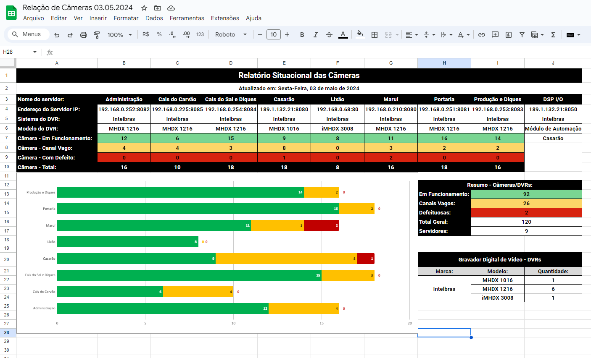
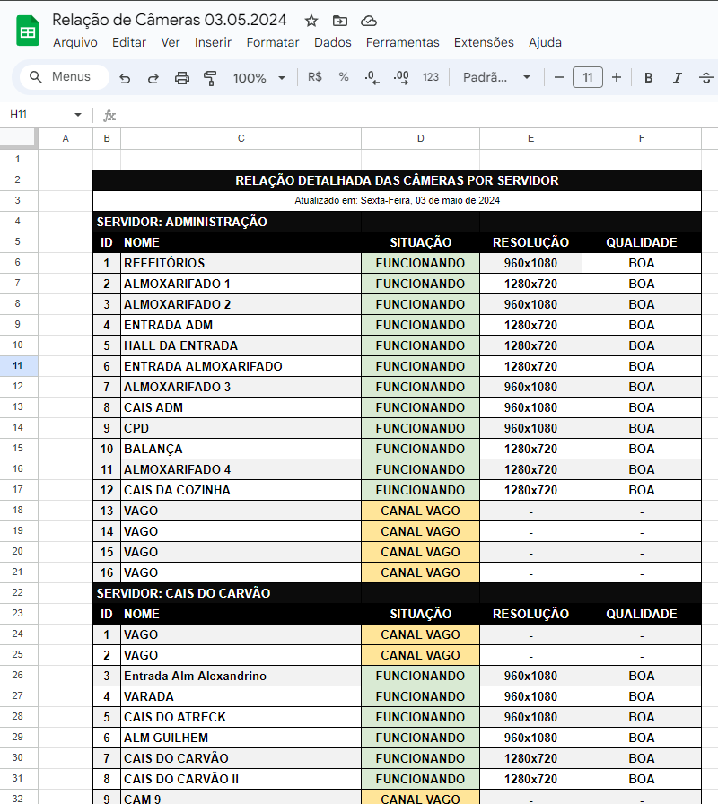
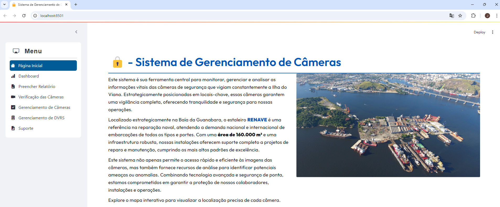
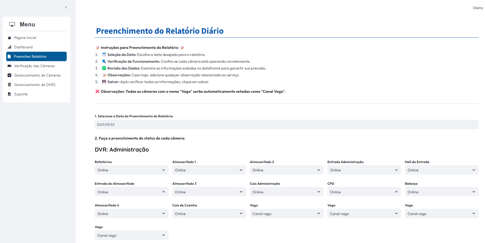
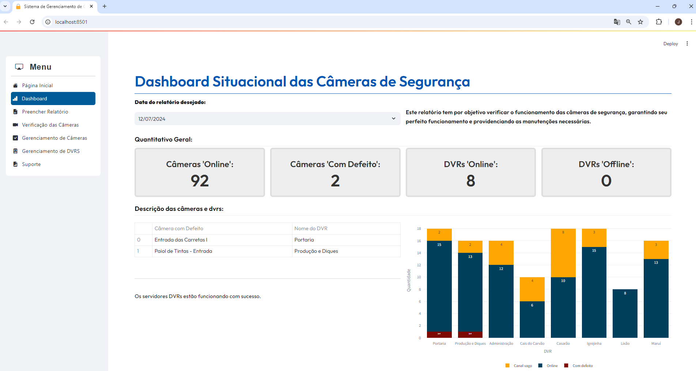
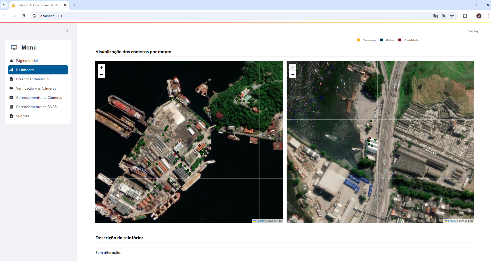
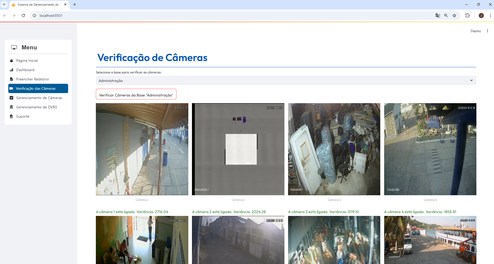
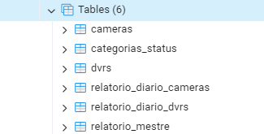
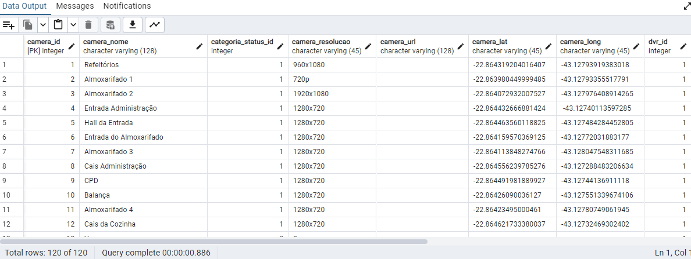
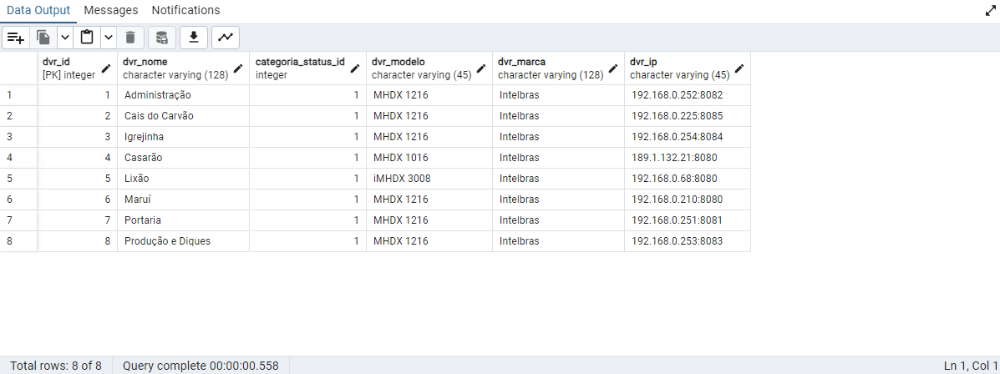

# security_manager_kairos

## Tecnologias Utilizadas

- Python | Streamlit | OpenCV | Pandas | Folium | SQL | PostgreSQL

## Descrição

Este sistema é um Sistema de Gerenciamento de Câmeras de Segurança desenvolvido em Python usando Streamlit. Ele permite a visualização, verificação e gerenciamento de câmeras e DVRs. A aplicação também oferece um dashboard para monitoramento situacional das câmeras, além de permitir o preenchimento de relatórios diários de funcionamento.

## Antes

Imagens de como eram armazenadas as informações antes do novo sistema:

- Dashboard em excel:

- Dados armazenados em tabelas:

## Depois

- Página Inicial do Sistema Atual

- Página de preenchimento do relatório:

- Novo modelo do dashboard:

- Verificação de funcionamento das câmeras através dos IPs:

- Banco de dados:
Tabelas:

## Funcionalidades

- **Página Inicial:** Descrição do sistema e mapa interativo com as localizações das câmeras.
- **Dashboard:** Visualização do status das câmeras e DVRs, com gráficos e mapas.
- **Preenchimento de Relatório Diário:** Interface para registrar o status diário das câmeras e DVRs.
- **Verificação das Câmeras:** Verificação do status de câmeras em várias bases via RTSP.
- **Gerenciamento de Câmeras e DVRs:** Interfaces para modificar as informações no banco de dados.

## Estrutura do Projeto

camera-management-system
│

├── app.py                   # Arquivo principal da aplicação

├── custom_pages/             # Páginas customizadas do sistema

├── database/                 # Conexão e consultas ao banco de dados

├── assets/                   # CSS e plugins adicionais

├── .env                      # Arquivo de configuração de variáveis de ambiente

├── requirements.txt          # Arquivo de dependências

└── README.md                 # Documentação do projeto